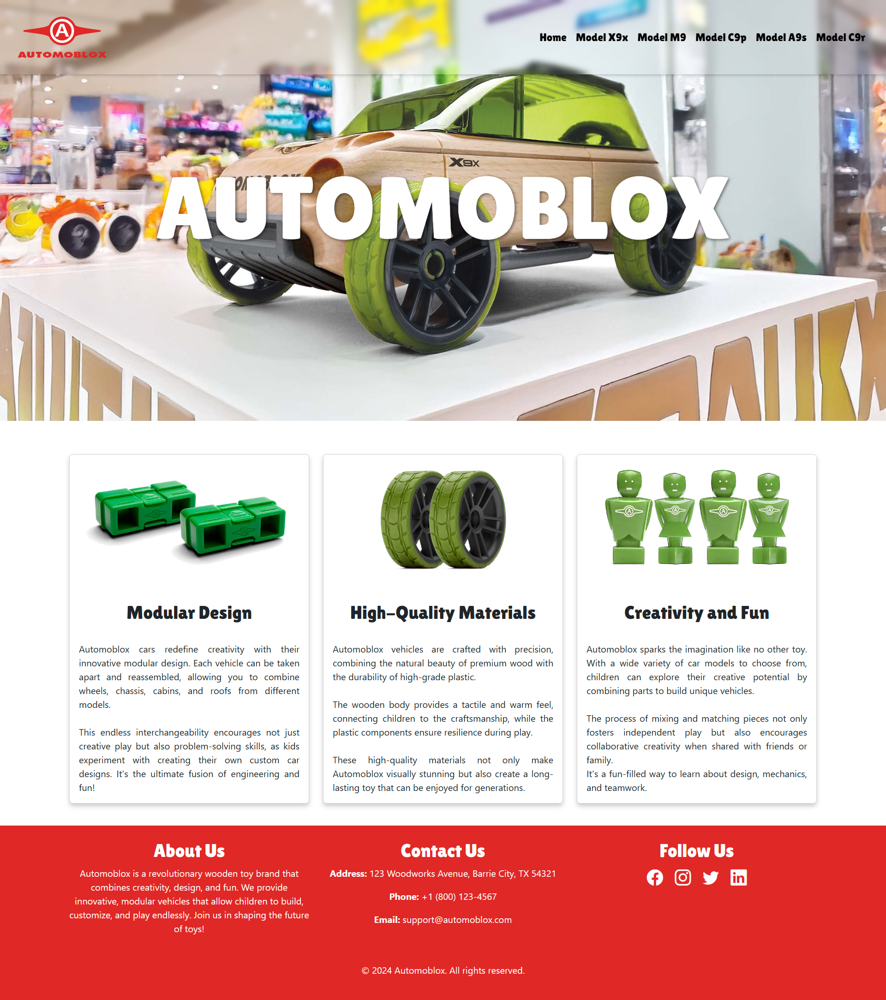
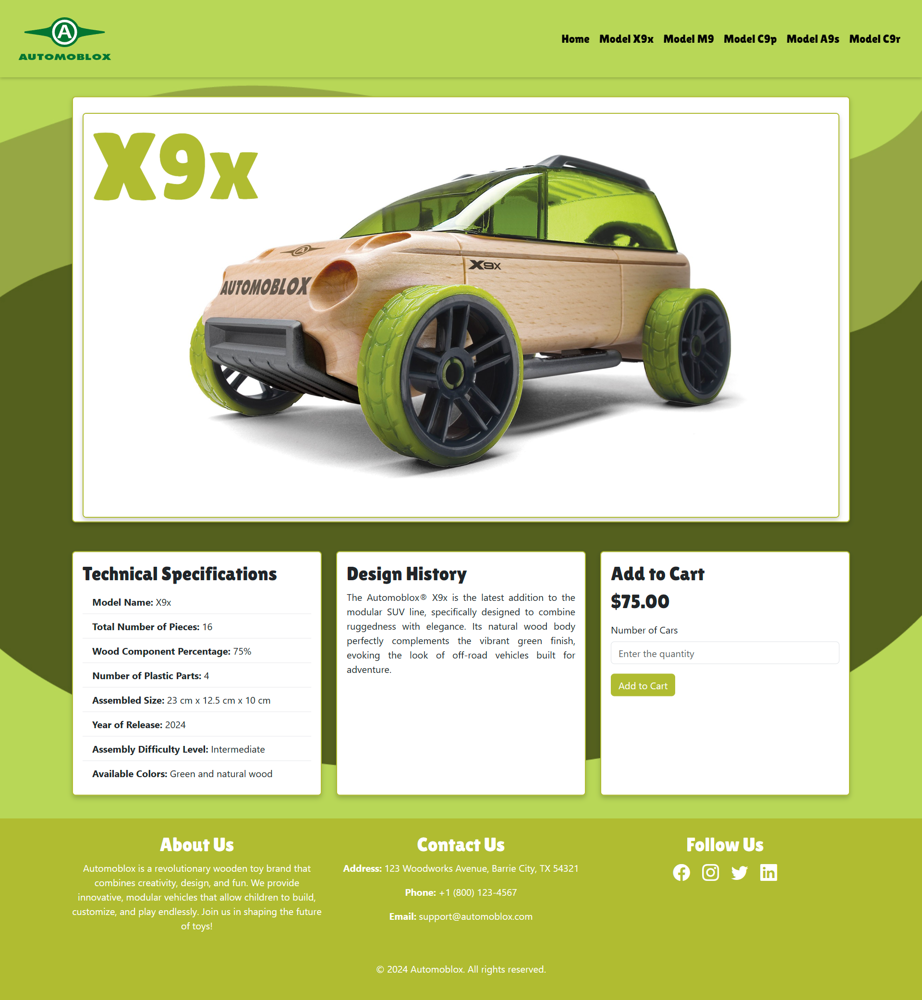

### The Automoblox Redesign

TOn your own, design and develop a small web site that features at least five (5) pages each featuring one of the Automoblox® wooden car kits. The site must feature CSS-based layout, interactive, and typographic techniques covered in class. 

&nbsp;

